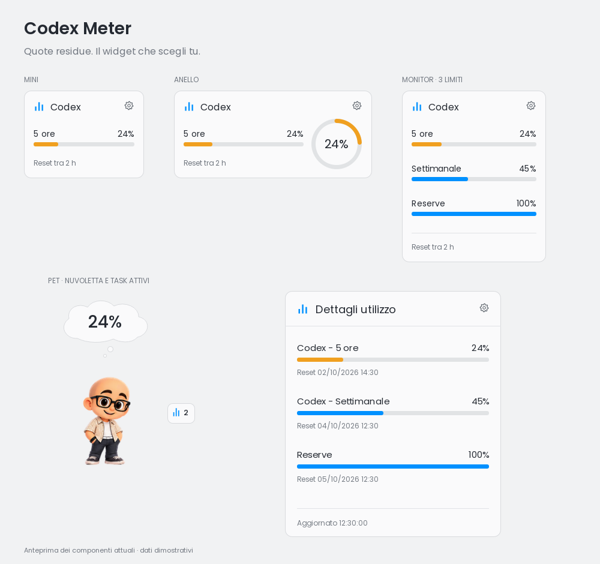
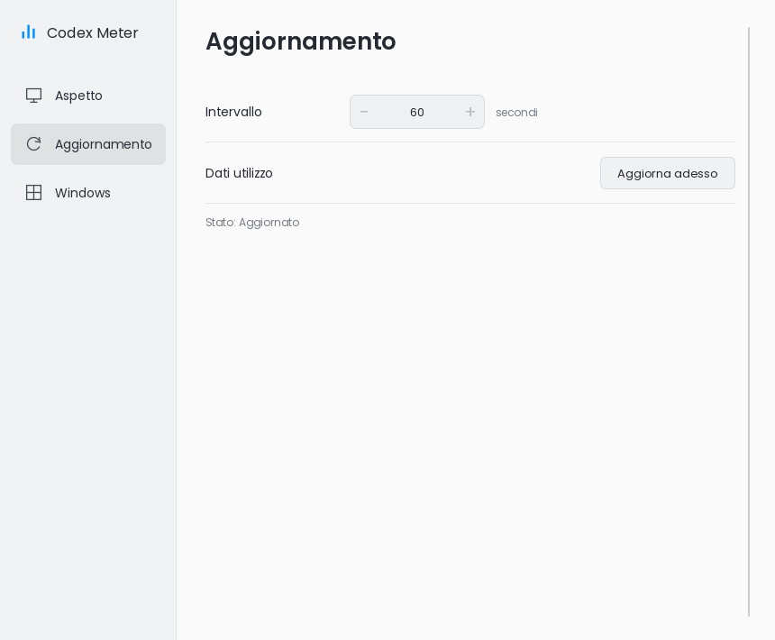
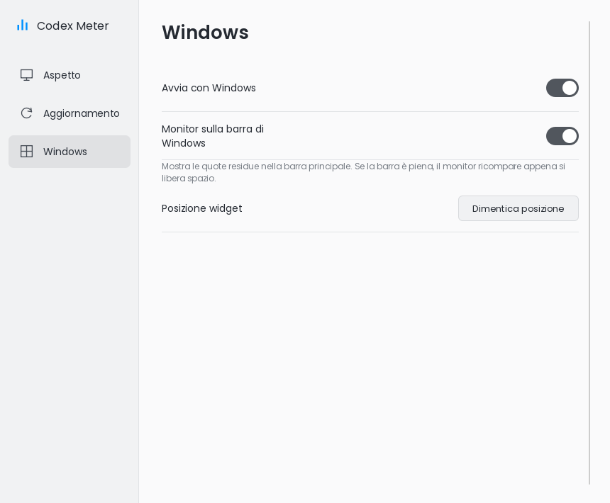
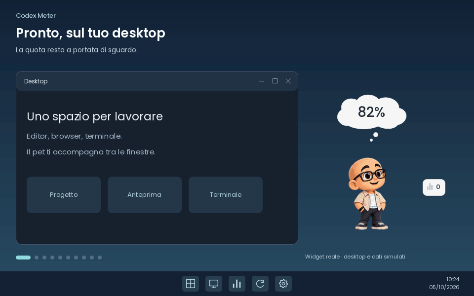

<p align="center">
  
</p>

<h1 align="center">Codex Meter</h1>

<p align="center"><strong>English</strong> · <a href="README.it.md">Italiano</a></p>

<p align="center">
  <strong>How much Codex do you have left? Just glance at your desktop.</strong><br>
  Remaining quotas, reset times, and local chat activity in a Windows widget.<br>
  Choose a compact card or an animated pet that follows your work in Codex.
</p>

<p align="center">
  
  
  
</p>

<p align="center">
  <a href="#installation"><strong>🚀 Try Codex Meter</strong></a>
  &nbsp; · &nbsp;
  <a href="#features">Explore the features</a>
</p>

<!-- TODO README: once a repository URL and Windows release are available,
     replace the CTA with https://github.com/OWNER/REPO/releases/latest,
     labeled "⬇️ Download Latest Release", and specify the exact asset name.
     Do not publish OWNER/REPO as a working link. -->

<p align="center">
  
  <br><sub>Widget preview using sample data. Actual limits depend on your Codex account.</sub>
</p>

## Why use it?

The interface is available in 11 languages. Select **Language** from the tray menu:
the change takes effect immediately and your preference is saved. See the [translation documentation (Italian)](translations/README.md).

When you work with Codex, knowing how much quota remains and when it resets helps you decide whether to keep going or take a break. Codex Meter keeps that information on your desktop, so you can check it at a glance.

Display just the percentage you care about, view three limits together, or work alongside a pet that reacts to activity in your local chats.

<a id="features"></a>

## ✨ Features

**Remaining quota at a glance**  
Percentages show how much you can still use. Click to view all available limits and their reset times: five-hour windows, weekly windows, and reserve quotas when returned by Codex. Refreshes are automatic, with an adjustable interval and a manual refresh command.

**Three ways to keep track**  
Choose **Compact**, **3 limits**, or **Pet**. Card views offer Mini, Ring, and Monitor styles; pets can show minimal information or a bubble. Adjust scale, opacity, and whether the widget stays on top, then drag it wherever you need it.

**A pet that follows your work**  
Mascots react to thinking, execution, review, waiting for input, completion, and errors or interruptions detected in local logs. Choose from nine included pets — Kira, DarkShrill, Germoglio, Pip, Clippy, Dario, Doraemon, Goku, and Mini Elon — or import your own from a compatible folder or ZIP archive.

**Active chats a click away**  
In Pet view, the counter opens **Active tasks**, showing the names and states of detected chats. Move the window to another monitor and customize the positions of information and popups for each pet.

**On the Windows taskbar, too**  
Enable the quota monitor on the main taskbar to see percentages and time until reset. The notification area icon lets you show or hide the widget, refresh data, choose a language, and open settings. You can also enable startup with Windows.

> Pet activity and the task list depend on local Codex sessions. Cloud-only tasks are not detected; some states or approval requests may not appear in the logs. With multiple chats, the pet follows the most recently active one. The taskbar monitor appears when there is free space.

## 👀 See it in action

| Data refresh | Windows integration |
| :---: | :---: |
|  |  |
| Choose how often quotas refresh. | Keep the monitor where it works best for you. |

<p align="center"><sub>Settings screenshots with sample data. The screenshots show the Italian interface.</sub></p>

<p align="center">
  
  <br><sub>DarkShrill, Mini Elon, and Dario in action: real widget components and animations, with a simulated desktop, activity, and quotas.</sub>
</p>
<!-- TODO README: add a screenshot of the pet with its bubble and the
     "Active tasks" window, and one of the taskbar monitor. -->

<a id="installation"></a>

## 🚀 Installation

**You need Windows 10/11 and Codex CLI already installed and authenticated.** Codex Meter uses the sign-in configured in Codex; you do not need to enter credentials in the app.

**Public download:** this copy of the project does not include a GitHub repository URL, installer, or complete Windows package. There is therefore no verifiable link to the latest release. Executables in the build folders are local builds.

If you have received a **complete Windows app folder**, open it and launch **`CodexMeter.exe`**, keeping all supplied files together. You do not need to install Qt separately if the required dependencies are included in the package.

If you only have the source code, see [Development](#development) for build instructions.

<details>
<summary>Codex not found?</summary>

### 1. Install Codex CLI

Codex Meter requires **Codex CLI** to be installed and authenticated.

On Windows, you can install the latest Codex CLI directly from PowerShell:

```powershell
powershell -ExecutionPolicy ByPass -c "irm https://chatgpt.com/codex/install.ps1 | iex"

Check from PowerShell:

```powershell
where.exe codex
codex --version
codex app-server --help
```

If you have just installed Codex, restart Codex Meter to refresh `PATH`. The app also checks the Windows locations defined in the code. To specify an executable explicitly, set `CODEX_CLI_PATH` to the path of `codex.exe` before launching the app.

</details>

## 🎯 How it works

1. **Launch Codex Meter.** The app starts `codex app-server` and reads the limits of the authenticated account.
2. **Choose your widget.** Open settings from the gear button or notification area icon, then select Compact, 3 limits, or Pet. Choose your preferred language from the tray menu.
3. **Place it on your desktop.** Drag it to the desired position and adjust scale, opacity, and whether it stays on top.
4. **Keep working.** Quotas refresh automatically. Click the widget for details and, in Pet view, click the counter to see active tasks.

## 💡 Why it exists

Reaching a limit in the middle of your work breaks your rhythm. Seeing the remaining quota and next reset ahead of time makes planning easier. Codex Meter was built to keep this information visible alongside your work; Pet view also gives you a visual signal of local activity.

## 🎨 Create and add your own pet

Turn your character into a widget: prepare **transparent PNGs** for the six sequences `idle`, `running`, `review`, `waiting`, `jumping`, and `failed`, then describe them in **`frames-manifest.json`** using the `codexmeter-16-pose-extension` schema.

1. **Draw the poses.** Use a consistent canvas, for example 192 × 208 px. Each sequence needs at least one frame; add more to animate it. Sixteen frames are not required.
2. **Prepare the package.** Organize the PNGs in `frames/<state>/` and use the [example manifest](docs/pets/frames-manifest.example.json), renamed to `frames-manifest.json`. The `frames` lists define playback order; `durations` specifies milliseconds per frame, with a default of 125 ms.
3. **Import it.** Under **Settings → Appearance → Pet → Pet / expression**, press **+** and select the complete folder or ZIP archive. The pet is added to the library and selected.
4. **Try it.** Enable **Animate pet**, check its gestures with **Test animations**, and arrange its elements with **State and positions**.

**[Read the full guide (Italian): folders, JSON format, animations, and importing →](docs/CREARE_UN_PET.md)**

## 🛠️ Technology

**C++17 · Qt 6 · Qt Quick / QML · qmake.** The interface uses Qt Quick Controls 2 and Poppins fonts, with native Windows APIs for system integration. Limits come from `codex app-server` over JSON-RPC; activity is read from sessions in `CODEX_HOME/sessions` or `~/.codex/sessions`. The app does not read or store OpenAI credentials directly.

<a id="development"></a>

## 🧑‍💻 Development

Install a **Qt 6 kit for Windows** with Core, Gui, Widgets, Qml, Quick, and QuickControls2, plus its matching compiler. The existing local build uses **Qt 6.9.0 with 64-bit MinGW**; the project does not specify a more precise minimum version than Qt 6.

Open [`CodexMeter.pro`](CodexMeter.pro) in Qt Creator, select the kit, and use **Build / Run**. To build from a command prompt configured for Qt and MinGW, start at the project root:

```bat
mkdir build\README-Release
cd build\README-Release
qmake ..\..\CodexMeter.pro CONFIG+=release
mingw32-make
release\CodexMeter.exe
```

With an MSVC kit, use the Qt/MSVC command prompt and replace `mingw32-make` with `nmake`. Reading real quotas also requires an authenticated Codex CLI.

<details>
<summary>Previews and tests</summary>

Debug builds include a QML gallery with sample data:

```bat
debug\CodexMeter.exe --preview
debug\CodexMeter.exe --preview SettingsPreview.qml
```

Preview files are in [`qml/previews`](qml/previews). C++ tests use Qt Test in [`activity-tests.pro`](tests/activity-tests.pro), [`taskbar-tests.pro`](tests/taskbar-tests.pro), [`pet-package-tests.pro`](tests/pet-package-tests.pro), and [`localization-tests.pro`](tests/localization-tests.pro). QML tests are in [`tests`](tests) and use Qt Quick Test. To update screenshots from the current components, follow the [capture procedure (Italian)](docs/capture/README.md).

</details>

<details>
<summary>Credits and asset licenses</summary>

Poppins includes the [SIL Open Font License](assets/fonts/OFL.txt). The Clippy atlas reference already documented in the project is the [codex-clippy script](https://github.com/Dimava/codex-clippy/blob/master/scripts/build-clippy-pet.ts).

This copy does not include a general project license; the font license applies to the font itself.

</details>

## ❤️ Support the project

If Codex Meter helps you, leave a ⭐ on GitHub to help others discover it.
